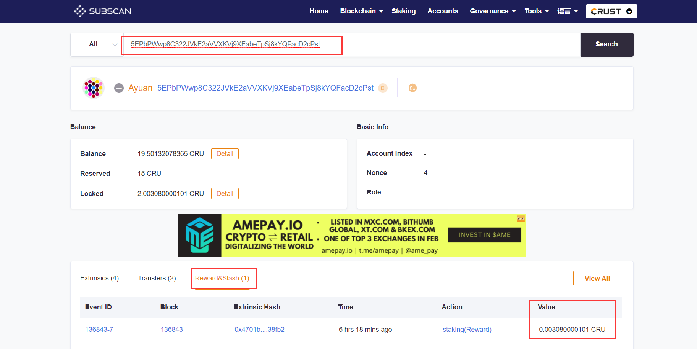
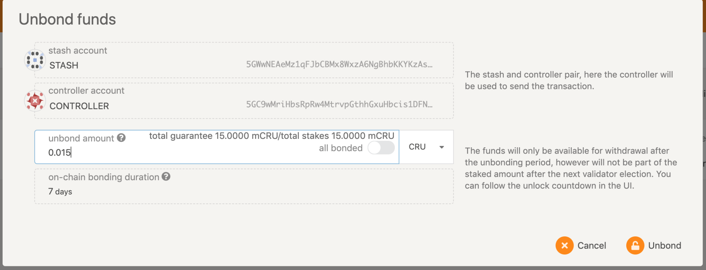

## Crust Mainnet

### Types of rewards？

There are three main types of rewards: authoring reward, staking reward and storage reward. All rewards will be settled in CRU.

## Validators and candidates

### How a candidate becomes a validator？
Through competition, nodes with larger "effective stake" (effective stake = other effective stake + own effective stake) will be selected as validators. "effective stake" is determined by two parameters. One is that you need to increase the "staking limit" by adding storage; the other is that you need to increase the "effective stake" by staking CRU or letting someone else guarantee the CRU for you. The selection of the validator is recalculated for each era. Check [this](validatorGuidance.md) for details

### The difference between validators and candidates？
Validators have authoring rewards, candidates do not have authoring rewards, but they all have staking rewards

### The icon meaning of validator page？

- 1 Your node will compete to become a validator competition in next era
- 2 The number of blocks produced in a session，one era has 6 sessions
- 3 The effective amount of CRU staked by others
- 4 The effective amount of CRU staked by yourself. The sum of parameter 3 and parameter 4 are used to compete to become a validator
- 5 The node's hard disk capacity and meaningful files determines the upper limit that the node can stake
- 6 The guarantee fee rate set by the node, assuming you set 90%, the node will draw 10% of the money from the guarantor’s income
- 7 The block score determines the profit of era. The data is the same for each validator in terms of probability
- 8 The latest block currently generated by the node

### The "stake limit" and "effective stake" are still 0 long after the node is started？
The "stake limit" is updated each hour, and the "effective stake" is updated every 6 hours. If the node is doing SRD, the "stake limit" increases linearly each hour. If the SRD is completed, the "stake limit" will remain unchanged. There is a drop, please check the cause in time

## Reward

### How the group distributes revenue？
The storage income is settled separately, while other income chains do not distribute income and need to be settled privately by the owner

### How to receive reward?
The process of receiving rewards is as follows:
Enter [Crust APPS](https://apps.crust.network/#/explorer), choose"Staking", choose"Payouts"

### How to check the reward?
Open [Subscan](https://crust.subscan.io/)
Use your income account to query, you can see the amount received in "Profit and Penalty"

## Others 

### How to modify guarantee fee?
------era1------era2------
The guarantee fee set during era1 will take effect during era2
If the validator has set the guarantee fee multiple times during era1, the last setting will take effect

### As a guarantor, how to cut guarantee?
>Note: Dosing operation is not supported.If more than one person is guaranteed,need to be cuted one by one

1) Through the STASH account of the guarantor, check out all the node's accounts guaranteed by the guarantor and the guarantee amount

2) Cut guarantee for each node

3) Query through the account of the guaranteed node found in step 1 and click on the account to enter the "guaranteed account", enter the amount of cancellation of the guarantee in the "amount", and click CutGuarantee.

### Unbond

>Note: **If you want to unbond all amount, the guarantor needs to cut all guarantees,** and other roles can unbond them directly

Enter the amount  in "unbond amount". The unbond process lasts for 28 eras. During this period, it cannot be used as stake. The funds will be transferrable after the unbond period.

### Member joins the group and reports "swork.IdentityNotExist" error, how to solve it?
This is because joining a group requires a unique identity on the chain, so you need to wait for the first report of the work report (about half a hour), and then perform the operation of joining

### Is a 1T system disk feasible?
Chain data will generate 250Gb data in about a year. If IPFS stores 400Tb of meaningful file , its data index will occupy 1T of capacity. Therefore, from the perspective of stable machine operation and disk utilization, it is recommended to use 2T SSD as the system disk.

### How to migrate Maxwell preview network account to main network?

Option one:

Import the backup file of the account on Maxwell to the main network, and then back up the account again to generate a new backup file, which can be configured to the node for use

Option two:

Import the backup file of the account on Maxwell to [Crust Wallet](crustWallet.md), switch the wallet network to Crust, and then export the backup file through the wallet to configure it to the node for use
