## 1 Basic knowledge

### 1.1 How long is ERA?

A block is about 6 seconds, and an ERA is about 6 hours. Many event updates are related to ERA, such as effective stake amount, validator selection, etc.

### 1.2 Mainnet lock time?

The unlocking time is 112era (28 days)

### 1.3 Types and forms of income?

There are three main types of income: block rewards, staking rewards and storage income. All proceeds will be settled in CRU. In the first year, the reward for network maintenance is 5,000,000 CRU, which will be 88% of the previous year in the following year, and so on. That is, in the first year, the rewards for each ERA include 684CRU block rewards (2736CRU per day) and 2737CRU staking rewards (10948CRU per day). The block rewards are equally distributed to validators based on the block production score, and the stake rewards are divided equally according to the effective stake. To verifiers, candidates, guarantors.

### 1.4 What is the reward for the 1PB machine?

You can simply use the daily additional issuance of CRUs to divide the total storage of the entire network. The total storage of the entire network can be viewed in APPS

```
Candidate 1P income = daily additional CRU issuance * 80% / P number of the entire network
Validator 1P revenue = daily additional CRU issuance*20% / total number of validators / node's P number + daily additional CRU issuance*80% / full network's P number
```


Since the validator will have an independent income of 20%, and the guarantee rates given by different nodes are different, the income of the nodes is not even.

### 1.5 How many CRUs does the mainnet 1T need to stake?

In the early stage of the main network, 1T can obtain a stake limit of 1CRU. Saving user data will increase the stake limit (up to 10 times), that is, 1 machine equals 10 machines.

### 1.6 How to transfer Maxwell preview network account to main network?

Method one:

Import the backup file of the account on Maxwell to the main network, and then back up the account again to generate a new backup file. Then forget this account and restore it with a new backup file, you can configure it to the node for use


Method Two:

Import the backup file of the account on Maxwell to [Crust Wallet](crustWallet.md), switch the wallet network to Crust, and then export the backup file through the wallet to configure it to the node for use

### 1.7 How many CRUs are needed to run the main network node?

For example, if there is one owner, two members, and each member is 100TB, then you need at least 1+(2+100)×2=205cru. If you consider free handling fees, add 24×2 (just lock up, not consumption), this cost is cost-effective in the long run. Check the definition of owner and member through [here](node-overview.md).

### 1.8 Unbonding CRUs

> Note: The amount of unbonding cannot exceed the amount that can be unbound. If you want to untie all the bonds, the guarantor needs to cancel all guarantees first, and other characters can untie directly


Enter the amount to be unbond in the "unbond amount". The unbond process lasts for 112 eras (28 days). During this period, it cannot be used as collateral. The funds will be withdrawn after the unbond period.


## 2 Verifiers and Candidates

### 2.1 What are candidates and validators?

Both validators and candidates are the maintainers of the network, responsible for generating blocks and packaging transactions. The difference is that the validator is a node with a high effective stake and directly participates in network maintenance, while the candidate, as a candidate for the validator, needs to be ready to produce blocks at any time.

### 2.2 The income difference between validators and candidates?

The candidate is a node that has not competed with the validator. It cannot get the block reward, but it can still get the staking reward. In the first year, the reward for network maintenance is 5,000,000 CRU, which will be 88% of the previous year in the following year, and so on. That is, in the first year, the rewards for each era include 684CRU block rewards (2736CRU per day) and 2737CRU stake rewards (10948CRU per day). The block rewards are equally distributed to validators based on the block production score, and the stake rewards are divided equally according to the effective mortgage. To verifiers, candidates, guarantors.

### 2.3 How can a candidate become a validator?

Through competition, the node with the highest effective stake amount will be selected as the validator. The storage capacity determines the upper limit of the stake, and the stake or guarantee determines the amount of stake. The minimum value of the upper limit of stake and the amount of stake is the effective stake. The stake upper limit is updated every 1 hour, and the stake amount and effective stake are updated every era. The verifier's selection is recalculated for each era. For details, please see this [link](validatorGuidance.md)


### 2.4 How does the total number of validators change?

The total number of validators will be dynamically adjusted. This setting is to ensure the sufficient competition and the network security. The technical committee will discuss and decide in the early stage. After the network is stable, the total number of validators will be increased or reduced through a motion vote.

### 2.5 What does the icon of the staking interface mean?


- 1 The next era will participate in the validator competition
- 2 The number of blocks produced in a session, an era has 6 sessions
- 3 Effective CRU staked by others
- 4 The effective amount of CRU staked by yourself, parameter 3 and parameter 4 are used to compete to become a validator
- 5 The value calculated by the node's hard disk capacity and meaningful files determines the upper limit that the node can stake
- 6 The guarantee fee rate set by the node, assuming you set 90%, the node will withdraw 10% of the guarantor’s income
- 7 The block score determines the profit of era. The data is the same for each validator in terms of probability
- 8 The latest block currently issued by the node

### 2.6 What does the guarantee fee (reward commission percentage) mean, and how much is appropriate?

Guarantee fee (percentage of reward commission): the proportion of the guarantor's share, the greater the value, the higher the guarantor's revenue share

The following is an example of a scenario: Suppose node A stakes 1000 CRU and is guaranteed 200 CRU, and its stake upper limit is 1000 CRU, and the guarantee fee is set to 30%. Assuming that each round of stake income is 600 CRU, if The effective stake amount of the whole network is 2000, then the income of each Era can be calculated as:

-The validator’s effective stake = minimum value (1000, 1200) * (1000 / 1200) = 1000 * (1000 / 1200) = 833.3 CRU

-Guarantor’s effective stake = minimum value (1000, 1200) * (200 / 1200) = 1000 * (200 / 1200) = 166.66 CRU

-Validator's income = 600 * (833.3 / 2000) + 600 * (166.66 / 2000) * 70% = 285 CRU

### 2.7 Increase/decrease stake

-Increase the amount of stake deposit


-Reduce the amount of stake deposit


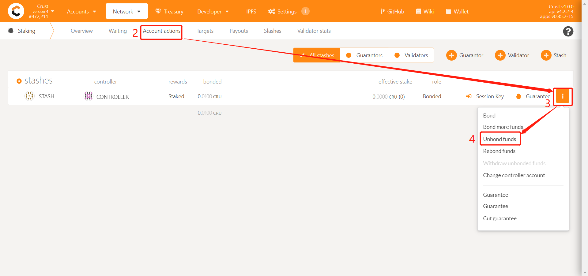

### 2.8 Impact of changing the guarantee rate

The guarantee rate can be changed at any time. When increased, the next era will take effect. When it is reduced, there will be an era penalty, that is, all the proceeds of the next era will be given to the guarantor.

## 3 Guarantor

### 3.1 How to change the guarantee object?

1) First cancel the guarantee object A


2) Re-select guarantor B for guaranty
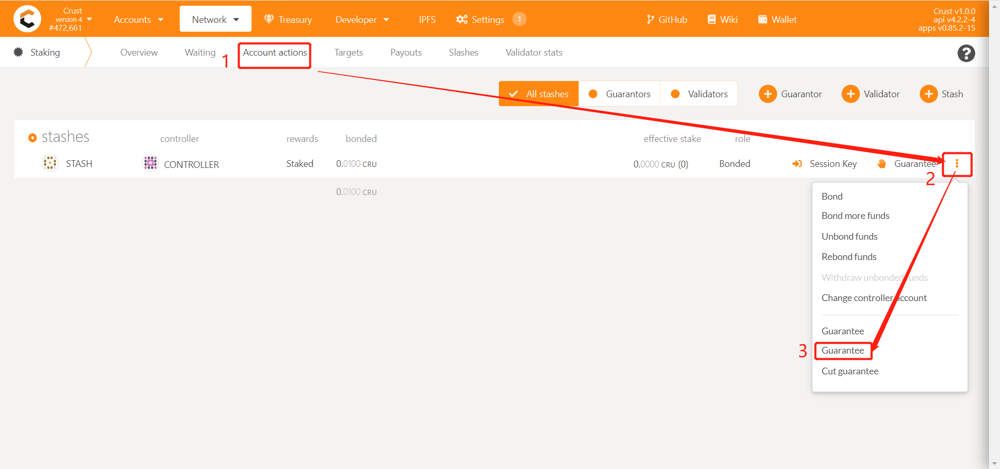


### 3.2 How to vouch for multiple validators/candidates?

When the amount of guarantee is sufficient, the guarantee operation can be performed multiple times, and a maximum of 16 validators (candidates) can be guaranteed

### 3.2 How many people can a validator/candidate be sponsored at most?

The upper limit is 64

### 3. As a guarantor, how to revoke the guarantee?

> Note: Dosing operations are temporarily not supported, and if multiple guarantees are guaranteed, the guarantees need to be revoked one by one

1) Through the STASH account of the guarantor, check out all the node accounts guaranteed by the account and the guarantee limit


2) Withdraw the guarantee for each node


3) Query through the account of the guaranteed person found in step 1 and click on the account to enter the "guaranteed account", enter the amount of cancellation of the guarantee in the "amount", and click CutGuarantee.

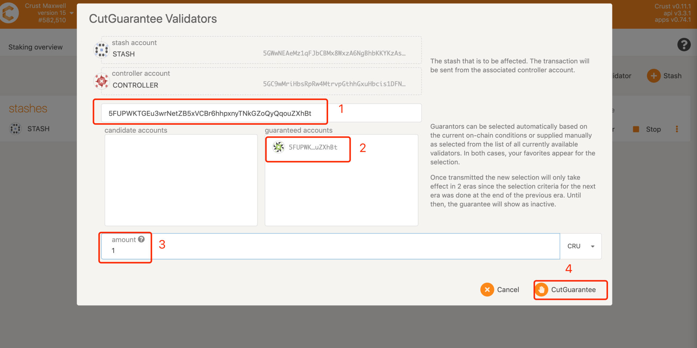

## 4 Rewards and Punishments

### 4.1 How to receive stake and guarantee rewards?

The process of receiving rewards is as follows:
Enter Crust APPS, choose Staking, choose Payouts


### 4.2 How do I check the income every time I stake and guarantee to receive a reward?

Open [Subscan](https://crust.subscan.io/)
Use your income account to check, you can see the amount received in "Profits and Penalties"
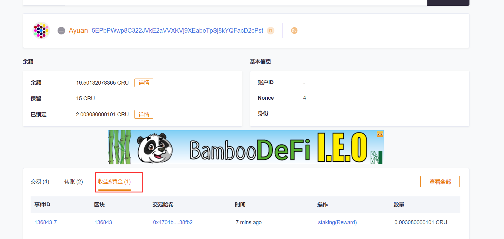

### 4.3 How to unlock the earnings?

The rewards of validators and candidates will be recorded in Stash and automatically mortgaged. You can observe the automatic increase of "total stakes" and "own effective stake". If you don't want to mortgage, you can perform the "unbond" operation to unlock.

The guarantor’s income will be credited to the guarantor’s stash account, and the status is bound. If you want to continue to guarantee the income, you need to manually operate it. If you want to untie, perform the "unbond" operation. Note that the amount of unbond is the value of the income.

The time to unlock the proceeds is 28 days

### 4.4 Owner node offline penalty related issues

a. Trigger conditions for forfeiture

-At the end of each Session (1 hour), it will be judged whether the validator is offline. When the validator is detected to be offline, the penalty mechanism will be triggered and the penalty amount calculation will start
-Each time a block is generated, the packager (author) of the block will be tested for double spending. If it is detected that the same block height is detected, when trying to generate two different blocks, it will be penalized

b. Result of confiscation

The mortgaged CRU will be deducted according to the penalty rate, and the validator identity will be removed, and the validator who is under penalty will lose the part secured before the penalty.

c. Penalty rate

The penalty amount is the maximum penalty ratio that occurs in a SlashingSpan multiplied by the validator's own effective stake amount.

```shell
Penalty ratio = min((3 * (k-(n / 10 + 1))) / n, 1) * 0.07
```

Among them, k is the number of offline eras on the entire network, and n is the number of overall validators (block producers). The number of dropped calls within 10% will not trigger the actual penalty, and will eventually climb linearly to the maximum value of 7%. When one-third of the validators are offline, the penalty ratio is approximately 5%.

d. Actual deduction time for fines and forfeitures

The penalty will not be issued immediately, and the money will be deducted after a delay of 108 Era (27 days).

### 4.5 Member node disconnection penalty

The loss of a Member node will trigger a penalty for reporting invalid workloads, which will result in a decrease in the effective stake amount. There is no benefit during this period of time, lasting about 9 hours, and the penalty time will be automatically extended

### 4.6 How does the Group distribute earnings?

Crust chain doesn't distribute revenue and need to be settled privately by the owner

## 5 Basic node problems

### 5.1 An apt update error occurs when installing Node

This is an error in the ubuntu system update package, and has nothing to do with crust. Generally, it can be solved by optimizing the network and replacing the mirror.

### 5.2 Owner's hardware requirements

- The network must be stable and have a public IP, otherwise unstable block production may lead to punishment
- Use SSD for hard disk, recommended 500GB ~ ​​1TB
- SGX is not required, cloud service machines are recommended

### 5.3 SGX settings

The SGX (Software Guard Extensions) module of the machine is turned off by default and needs to be set in the machine's BIOS. First set the SGX switch to enable, and at the same time turn off Secure Boot (some motherboards do not). If SGX only supports software enabled, please refer to this link [https://github.com/intel/sgx-software-enable](https://github.com/intel/sgx-software-enable), or use the following command :

```plain
wget https://github.com/crustio/crust-node/releases/download/sgxenable-1.0.0/sgx_enable && sudo chmod +x sgx_enable && sudo ./sgx_enable
```

### 5.4 Reasons and solutions for peers of the chain not going up

Peers can't go up mainly because of network problems, such as no fixed IP, insufficient bandwidth, and network segments are isolated. Generally, the network needs to be upgraded to solve this problem. Of course, it may also be because there is no fixed IP or because a large number of Member nodes are started in the same LAN. Port forwarding can be used to relieve a large number of Member nodes in the same LAN. The specific operations are as follows:

- Execute the command 'sudo crust config chain-port 30889' to change the port of the Member A node to 30889

- Execute the 'sudo crust config generate' command to generate configuration files

- Execute the 'sudo crust reload chain' command to restart the chain service

- Configure the 30889 port forwarding of this Member A node's intranet on the router side

- By analogy, MemberB node does 30887 port forwarding, and MemberC node does 30886 port forwarding

### 5.5 How to migrate owner

Divided into the following four steps

- Stop verification on APPS and wait for 1 era
- Stop the original owner
- Activate the new owner and get a new session key
- Set a new session key and click again to verify

### 5.6 Chain log error

If the following error occurs, it means that the chain data is damaged, execute 'sudo rm -rf /opt/crust/data/chain/chains/crust/db/' command to delete the chain db, and then execute 'sudo crust reload chain' to resynchronize the chain data. If it appears again, indicating that the system disk has bad sectors, please replace the system disk immediately


 
## 6 Member node related

### 6.1 Error installing SGX driver

-BIOS settings error

If the following error occurs, you need to check whether the relevant items in the BIOS are set. You need to set secure boot to **Disabled** and SGX to **Enabled**. If SGX cannot be set to **Enabled**, it can be set to **software enabled**, and after booting into the system, use software to activate SGX.
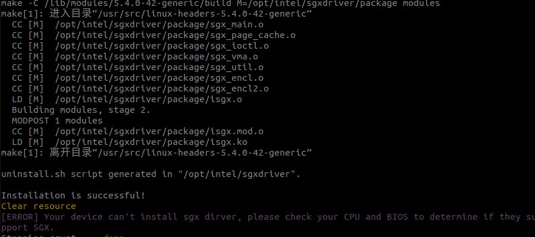

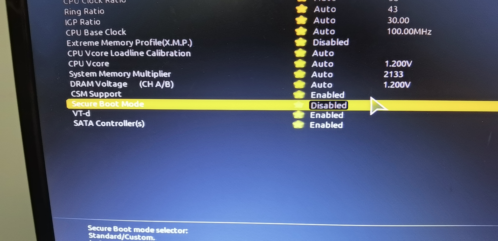


- Network Error

As shown in the figure below, it is a network error, you need to check whether there is a problem with the network connection
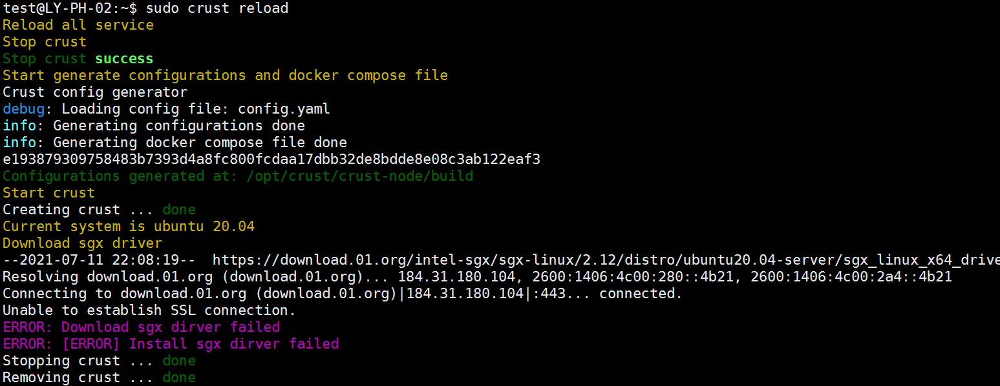

-Install dependent libraries

If the error is shown in the figure below, you need to enter the specified instructions to fix the error according to the error prompt given by the system during installation
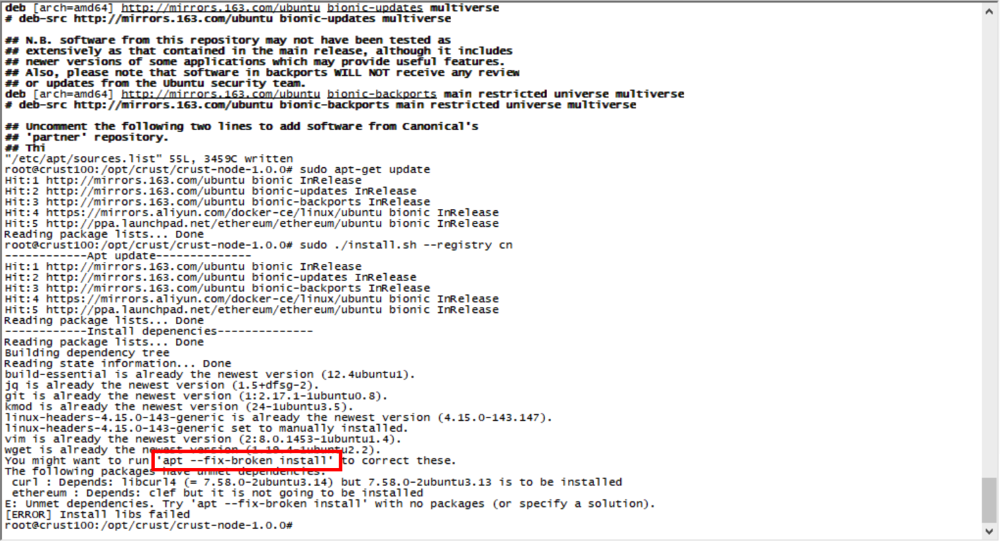

-Drive conflict

If you have installed other SGX drivers before, there may be driver conflicts. It is recommended to reinstall the system directly

### 6.2 How to mount the hard disk

Points to note before installation:

System disk configuration:

-The program will be installed in the /opt/crust path, please make sure that the system disk has more than 2TB of solid state drive space. If you do not want to use the system disk, but use other solid state drives, please create the /opt/crust directory in advance, and hang the solid state in this directory, pay attention to the read and write permissions of the directory

File disk configuration:

The order file and SRD placeholder file will be written in the /opt/crust/disks/1 ~ /opt/crust/disks/128 directory, depending on how you mount the hard disk. Each physical machine can be configured with up to 500TB of reserved space

-Single mechanical hard disk: directly mount to /opt/crust/disks/1

-Multiple mechanical hard disks (multi-directories): Mount the hard disks to the /opt/crust/disks/1 ~ /opt/crust/disks/128 directories respectively. For example, if there are three hard disks /dev/sdb, /dev/sdc and /dev/sdd, you can mount them to /opt/crust/disks/1, /opt/crust/disks/2, / opt/crust/disks/3 directory. The efficiency of this method is relatively high and the method is relatively simple, but the fault tolerance of the hard disk will be reduced

-Multiple mechanical hard disks (single directory): For hard disks with poor stability, using RAID/LVM/mergerfs and other means to combine the hard disks and mount them to the /opt/crust/disks/1 directory is an option. This method can increase the fault tolerance of the hard disk, but it will also bring about a drop in efficiency

-Multiple mechanical hard drives (hybrid): Combine single directory and multiple directories to mount

You can use the following command to view the specific situation of the file directory mounting:
```shell
sudo crust tools space-info
```

### 6.3 Can member nodes use network hard drives?

Can be used, but only supports mounting a single path /opt/crust/disks/1

### 6.4 How to add hard disks to the running Member node?

Tip: Adding a hard disk requires restarting the crust service. Restarting sworker will trigger a penalty for invalid workload, which lasts for about 9 hours without gains.

- Execute the sudo crust stop sworker command to stop the sworker service

- Mount the hard disk that needs to be added to /opt/crust/disks/1 ~ /opt/crust/disks/128

- Execute the sudo crust start sworker command to start the sworker service

- Execute sudo crust tools change-srd xxx to add srd packaging task

### 6.5 Sworker startup error

- Upgrade BIOS

If the error is shown in the following figure, the BIOS firmware needs to be upgraded or downgraded, and the version number of the BIOS needs to be adjusted to the appropriate version (upgrade or downgrade according to the specific situation). If it fails, replace the motherboard.


- Unstable network

4012 and AES service problems occur, indicating that the network is unstable, please adjust the network


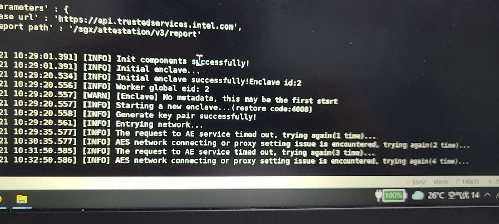
The IAS request failed because the IAS server is unstable. Please try again until it succeeds.
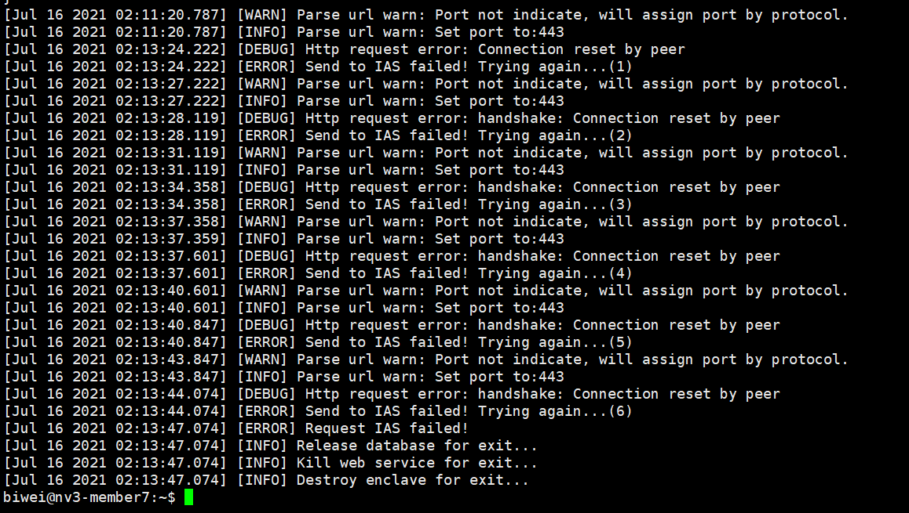

- Configuration error

The error shown in the figure below is because the user has changed the backup configuration, which makes it impossible to restart. Please use the backup of the account configured at the first startup. If you are sure to change the account, please clear all files and reconfigure the node.

The error shown in the figure below is because you did not follow the steps to set up, please strictly follow the node manual for related operations


- Other startup errors

If the above error does not appear, but it still cannot be started, please try to restart several times

### 6.6 What is the reason for the error "Inability to pay some fees, e.g. account balance too low" reported in the sworker log?

- Execute sudo crust logs chain to view the log of the chain, and check whether the best block height is consistent with the Apps block height. If it is inconsistent, execute the following command to restart sworker

```shell
sudo crust reload sworker
```

- Confirm whether the account configured by the Member node has a certain number of CRUs

### 6.7 sworker log report "Unable to decode using the supplied passphrase"

The account password configured on the Member node is incorrect

### 6.8 Hard disk device error

- The following are several common problems caused by unstable disks or improperly configured permissions. If the following errors occur, please check the disk and related read and write permissions

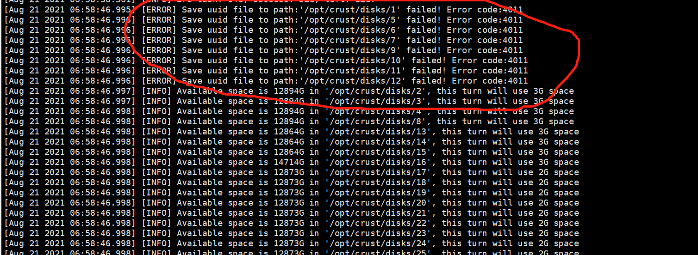


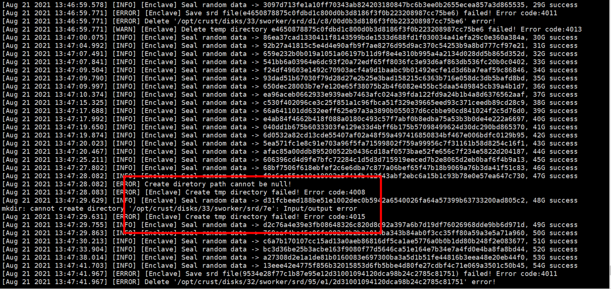

- When checking the workload, it is stuck, indicating that there is a problem with the tracks of some disks, and the disk needs to be tested


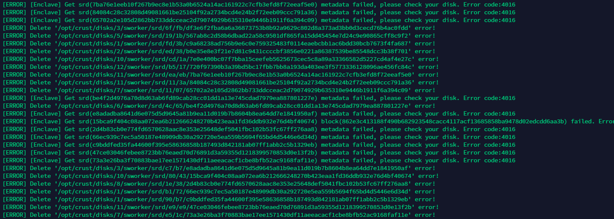

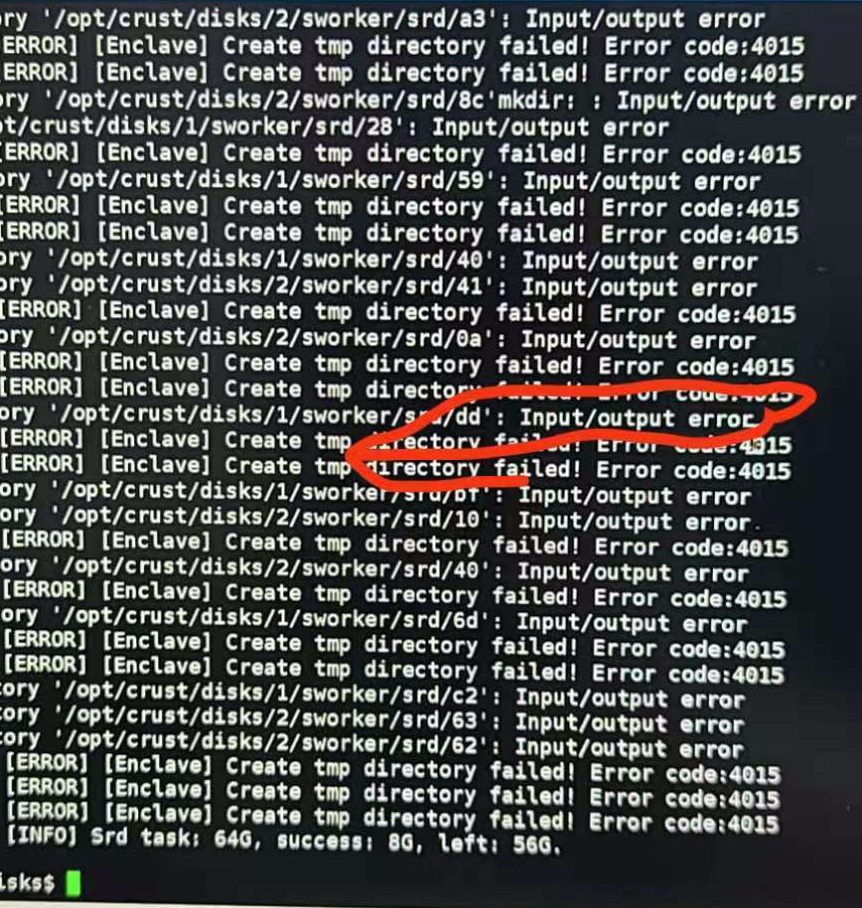


### 6.9 Sworker workload reporting error

Use the following command to view the cause of the workload reporting error:

```shell
sudo crust logs sworker | grep'WRE'
```

In most cases, it is caused by unstable chain synchronization, try to improve the network environment

### 6.10 Can the encapsulated computing power be cut to another machine for mining?

No, the encapsulated computing power is related to the SGX module, and the hardware key of each SGX module is different

### 6.11 illegal reporter

The account configured by the member is duplicated with other members

### 6.12 Sworker log report "Input/output error"
Disk failure, read and write errors, please check the hardware configuration of the disk, Raid card, power supply, etc.


### 6.13 Sworker log report "Get srd (hash) metadata failed ,please check your disk. Error code:4016"
If the program fails to retrieve the packaged data, please check the disk read and write failure caused by the hardware configuration of the disk, Raid card, power supply, etc., or the hard disk is not mounted before restarting the computer


Execute 'sudo crust tools workload' command to check if the sum of "srd_complete" and "disk_available_for_srd" is much smaller than disk_volume, it is recommended to re-srd

The solution is as follows

- Ensure that the disk reads and writes normally

- Execute 'sudo crust stop sworker' command to stop the sworker program

- Execute 'sudo rm -rf /opt/crust/data/sworker' to delete sworker metadata

- Format the mechanical hard disk and remount it to /opt/crust/disks/1~128

- Execute 'sudo crust reload sworker' command to restart the sworker program

- Execute 'sudo crust tools change-srd xxx' command to issue the srd task

### 6.14 Sworker log report "...swork.IllegalFilesTransition..."


Reason:Unstable network causes the expected workload to be sent to be inconsistent with the actual workload

The solution is as follows:
- Keep sowkrer service online
- git clone https://github.com/MyronFanQiu/Recover-Illegal-Files && cd Recover-Illegal-Files
- yarn
- yarn start

### 6.15 Sworker log report "...Priority is too low..."


The chain synchronization is unstable due to network problems, and the local block height is lower than the  maximum block of the main network

The solution is as follows:
- Option 1 : Increase network bandwidth, configure a fixed IP or reduce the number of member nodes in the same LAN
- Option 2 : [Set the chain P2P port](buildNode#24-set-the-p2p-port-of-the-chain), restart the chain service and then configure port forwarding and [QoS](nodeQos) on the router 

## 7 related groups

### 7.1 Why can't a member add a group?

- The Member node needs to report the workload once to add the group. This process takes a long time, about an hour. If the workload is not reported, the group will report the swork.IdentityNotExist error. You can see whether the workload is reported by the following command on the member machine

```shell
sudo crust logs sworker | grep'Send work report'
```

- Member accounts need to be added to the whitelist of the group before they can be added to the group

- Double check whether the right account is selected and whether the top or bottom is reversed

- A Member with meaningful files cannot be added to a group, it will report Illegal Spower, please refer to how to change the group of the Member node

### 7.2 Lockup CRU to reduce the fee of the work report

- Why lock

The reporting of the workload of the main network requires a handling fee. Under normal circumstances, each Member will carry out 24 workload reporting transactions per day, which brings a lot of handling fees. For this reason, the Crust network provides a Benefit module that exempts workload reporting fees. Group owners can reduce or waive member handling fees by locking CRUs.

- Why lock 30

Each member needs to lock 18CRU for fee reduction. However, considering the unstable situation of workload reporting, it is recommended to lock 24CRU~30CRU to ensure that the fee is completely free. For example, suppose your Group is ready to have 6 members ready to join, then lock 30*6=180CRU

- How much can be saved

The handling fee for workload reporting is related to the meaningful file changes reported in each round. Damage to the hard disk and instability of the network will increase the handling fee. Preliminary estimates are that the handling fee for each member for one year is between 1CRU ~ 20CRU


### 7.3 How to change the group of Member nodes?

- Exit the old group


- Execute the following command to query whether the Member node has received meaningful file orders
```shell
sudo crust tools file-info all
```
- If you have received a meaningful document order, call the following command to delete it, and wait for the next workload report, which will be reported every 1 hour
```shell
sudo crust tools delete-file {cid}
```

- Add whitelist


- Join a new group


## 8 Other

### 8.1 What is the reason why the stake limit is 0?

> Note: The stake limit is updated every hour, and the effective stake is updated every 6 hours

-Check whether you have clicked to verify. After verification, you need to wait for 1 hour to display the stake limit

-Check whether the Member node is correctly added to the group

-Member node plus group time needs to exceed the mortgage limit of 1 hour before it will be displayed

-Check if the chain of the owner node is synchronized normally and there is no disconnection


### 8.2 There is a mortgage limit, but why is the effective mortgage still 0?

The amount staked by yourself or guaranteed by others will take effect after 1-2 eras, and it takes about 6-12 hours to wait

### 8.3 Walletconnect can't connect to myetherwallet after claiming the operation wallet?

- Install [Little Fox Wallet (Metamask)](https://metamask.io/download.html), browser plug-in version is recommended

- Import imtoken or other private keys that cannot be walletconnect wallets into Little Fox Wallet

- Use the little fox wallet to connect to myetherwallet for signing

### 8.4 The 1T SSD of the system disk is not supported

Chain data will generate 250G of data in about a year. If IPFS stores 400T of data, its data index will occupy 1T of capacity. Therefore, from the perspective of stable machine operation and disk utilization, it is recommended to use 2T of SSD
