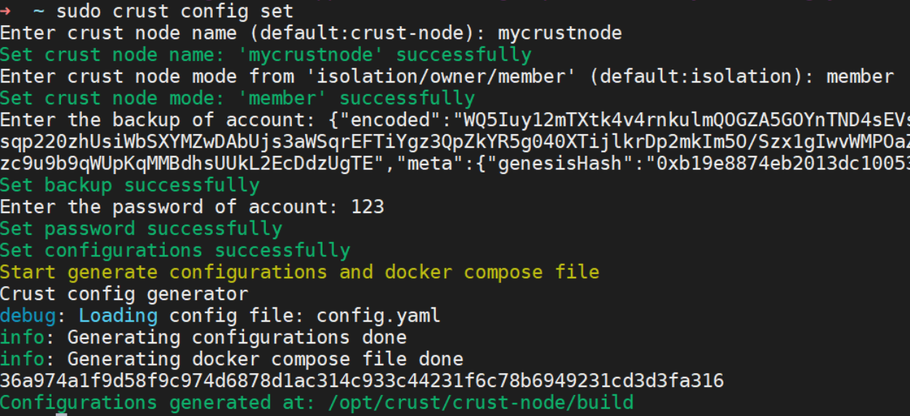
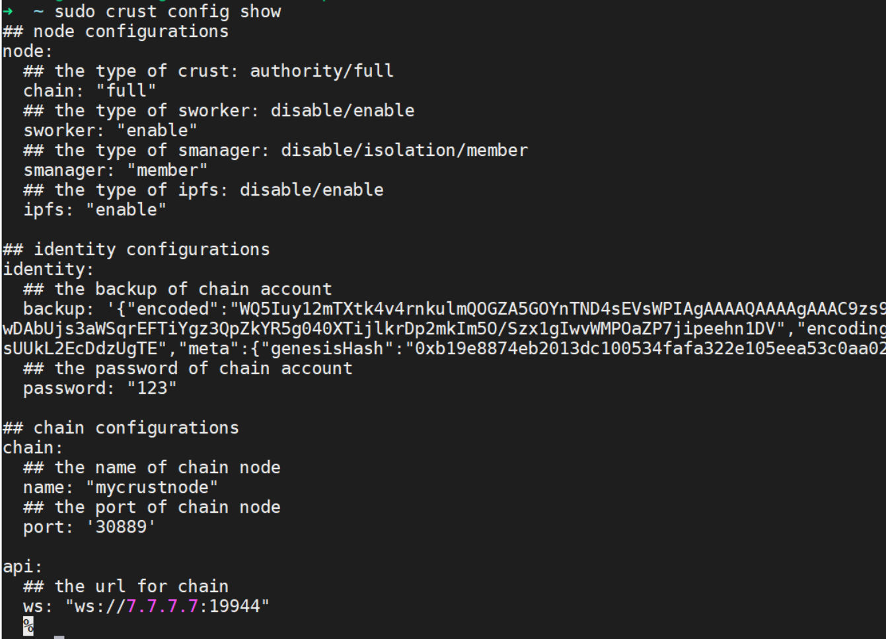
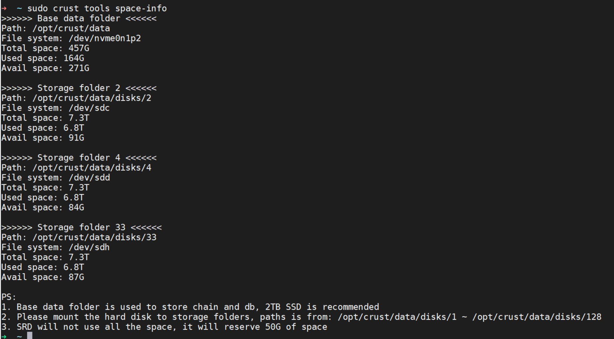
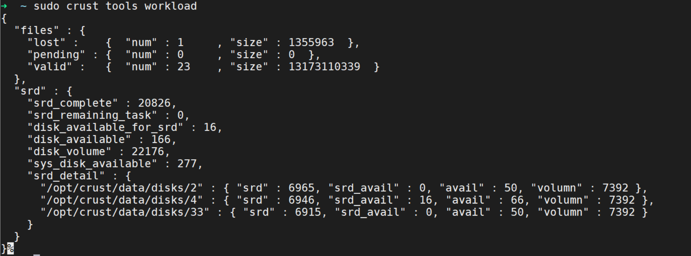

Crust Node program is a set of integrated scripts to facilitate node operation. Crust Node program is open source on [Github](https://github.com/crustio/crust-node). You can refer to it for more technical details, and customize or create your own node scripts from there, to ease your own node operation.


## Basic Command

### System

#### 1. Generate session key of chain node

- Command
```shell
sudo crust tools rotate-keys
```

- Instance


#### 2. Change sworker's srd capacity(GB)
- Command
```shell
sudo crust tools change-srd {number}
```
- Instance

Add 1000Gb srd capacity


Decrease 500Gb srd capacity


### Config

#### 1. Set and generate new configurations

Configure node name, node type, account backup file and password

- Command
```shell
sudo crust config set
```
- Instance



#### 2. Generate new configurations

- Command
```shell
sudo crust config generate
```

Manually modified '/opt/crust/crust-node/config.yaml'

```shell
sudo vi /opt/crust/crust-node/config.yaml
```
Then generate new configurations


#### 3. Set the rpc port of the chain

- Command
```shell
sudo crust config chain-port {port}
```

- Instance

Change the default port 30888 of the chain to 30889
```shell
sudo crust config chain-port 30889
```


#### 4. Set up to connect to other chains

Set up to connect to other chains,default is "ws://127.0.0.1:19944"

- Command
```shell
sudo crust config conn-chain {ws}
```
- Instance

Set up a chain connected to "ws://7.7.7.7:19944"

```shell
sudo crust config conn-chain ws://7.7.7.7:19944
```


#### 5. Query configuration file

- Command
```shell
sudo crust config show
```

- Instance


#### 6. Set sworker log level

- Command
```shell
sudo crust tools set-sworker-debug {true|false}
```
- Instance

Enable DEBUG log

Disable DEBUG log


### Control

#### 1. Start Crust service
- Command

```shell
sudo crust start {chain|api|sworker|smanager|ipfs}
```
- Instance

Start all Crust service
 ```shell
sudo crust start
 ```
Start one Crust service
 ```shell
sudo crust start smanager
 ```

 ```shell
sudo crust start api
 ```


#### 2. Stop Crust service

- Command
```shell
sudo crust stop {chain|api|sworker|smanager|ipfs}
```
- Instance

Stop all Crust service


Stop one Crust service
```shell
sudo crust stop api
```

```shell
sudo crust stop smanager
```


#### 3. Reload Crust service

- Command
```shell
sudo crust reload {chain|api|sworker|smanager|ipfs}
```
- Instance

Reload all Crust service


Reload one Crust service


### Monitor
#### 1. Query the detailed information of the Crust node

Includes node network, type and version, Sworker details, Docker ImageID and other information 

- Command
```shell
sudo crust version
```
- Instance


#### 2. Query Crust node service status

- Command 
```shell
sudo crust status {chain|api|sworker|smanager|ipfs}
```
Includes three status: running, stop, and exited 
|**Status**|**Description**|
|-----|-----|
|running |Service is running normally|
|stop|Service is stop|
|exited|Service exits abnormally, query log analysis|

- Instance

Query Crust node's all service status

Query Crust node's one service status


#### 3. Query node logs

Track service logs, ctrl-c to exit. use 'crust logs help' for more details

- Command
```shell
sudo crust logs {chain|api|sworker|sworker-a|sworker-b|smanager|ipfs}
```

- Instance

Query the latest 5 log lines of the node sworker service
```shell
sudo crust logs --tail 5 sworker
```


#### 4. Disk usage details of "base data" and "storage data"

Note:
1. Base data folder is used to store chain and db, 2TB SSD is recommended, you can mount SSD on /opt/crust/data
2. Please mount the hard disk to storage folders, paths is from: /opt/crust/disks/1 ~ /opt/crust/disks/128
3. SRD will not use all the space, it will reserve 50G of space

- Command
```shell
sudo crust tools space-info
```
- Instance

The disk has been successfully mounted in the three directories /opt/crust/data/disks/2, /opt/crust/data/disks/4, /opt/crust/data/disks/33


#### 5. Query the status of the files and srd of the node

- Command
```shell
sudo crust tools workload
```
File parameter description
|**Parameter**|**Description**|
|----|----|
|files-lost|Lost files|
|files-pending|Pending files|
|files-vaild|Valid files|

Srd parameter description
|**Parameter**|**Description**|
|----|----|
|srd_complete|Completed srd capacity, unit Gb|
|srd_remaining_task|Remaining srd tasks|
|disk_available_for_srd|Disk capacity of currently available srd|
|disk_available|Disk capacity currently available|
|disk_volume|Total disk capacity|
|sys_disk_available|Available capacity of system disk|
|srd_detail|Usage details of each storage filder|

- Instance


### Upgrade

#### 1. Upgrade the docker image of the node service

- Command
```shell
sudo crust tools upgrade-image {chain|api|smanager|ipfs|c-gen|sworker}
```

- Instance

Upgrade the chain's docker image
```shell
sudo crust tools upgrade-image chain
```

Upgrade the IPFS docker image
```shell
sudo crust tools upgrade-image ipfs
```

#### 2. sworker's AB upgrade

- Command
```shell
sudo crust tools sworker-ab-upgrade {code}
```
The parameter code is the only mrenclave code

- Instance
```shell
sudo crust tools sworker-ab-upgrade 032ceedd27918ddb4807c78ec5734a8a49878a2e7a7001381b90eae8d1d1c093
```


### File

#### 1. Query file information

- Command
```shell
sudo crust tools file-info {all/valid/lost/pending} {output-file}
```

- Instance

Query all order information

Query the order information in pending


#### 2. Delete files

- Command
```shell
sudo crust tools delete-file {cid}
```
- Instance

Delete the file whose cid is QmaK1Rbc4AYtDJoTLgZQNZx4JpDPYrN2DW269i54eA5Phk
```shell
sudo crust tools delete-file QmaK1Rbc4AYtDJoTLgZQNZx4JpDPYrN2DW269i54eA5Phk
```


### Others

#### 1. IPFS command

- Command
```shell
sudo crust tools ipfs {…}
```

- Instance

View the contents of a file
```shell
sudo crust tools ipfs cat QmddN7QgY7RHtsGN8bnUqWJq4VpMam2HXrRDafe5pBt3eq
```


## Configure foreign aid chain

- Command
```shell
sudo crust tools watch-chain
```
Generate a "watch-chain.yaml" configuration file in the current directory, and use docker-compose to start the watcher node

Note:
1.	Edit the "watch-chain.yaml" file to customize the watcher node 
2.	The watcher node can provide ws and rpc services, the default port is 30888, 19933, 19944, open the port before starting
3.      The simplest startup example: 'sudo docker-compose -f watch-chain.yaml up -d'
4.	With external connect chain configuration, a topology structure where one chain node serves multiple members can be realized

- Instance

Three member nodes are connected to the same watcher node to report workload

Watcher node

Select a server with good network configuration to start the watcher node (recommended to use a network with a public IP)

Generate configuration:
```shell
sudo crust tools watch-chain
```
Edit configuration:
```shell
sudo vim watch-chain.yaml
```
Start：
```shell
sudo docker-compose -f watch-chain.yaml up -d
```
Monitor：
```shell
sudo docker logs crust-watch
```
Wait for the chain to synchronize to the highest block height before proceeding as follows

Member node

1. Before starting a member node, set the watcher node as a foreign aid chain, refer to[conn-chain](#4-set-up-to-connect-to-other-chains)
2. Build a member node, refer to [member node](https://wiki.crust.network/docs/en/memberNode)

## Set SGX driver to install automatically

- Disable automatic installation of SGX driver

Execute the following commands before starting the node:
```shell
sudo mv /opt/crust/crust-node/scripts/install_sgx_driver.sh /opt/crust/crust-node/scripts/install_sgx_driveroff.sh
```
- Enable automatic installation of SGX driver

Execute the following commands before starting the node:

```shell
sudo mv /opt/crust/crust-node/scripts/install_sgx_driveroff.sh /opt/crust/crust-node/scripts/install_sgx_driver.sh
```


