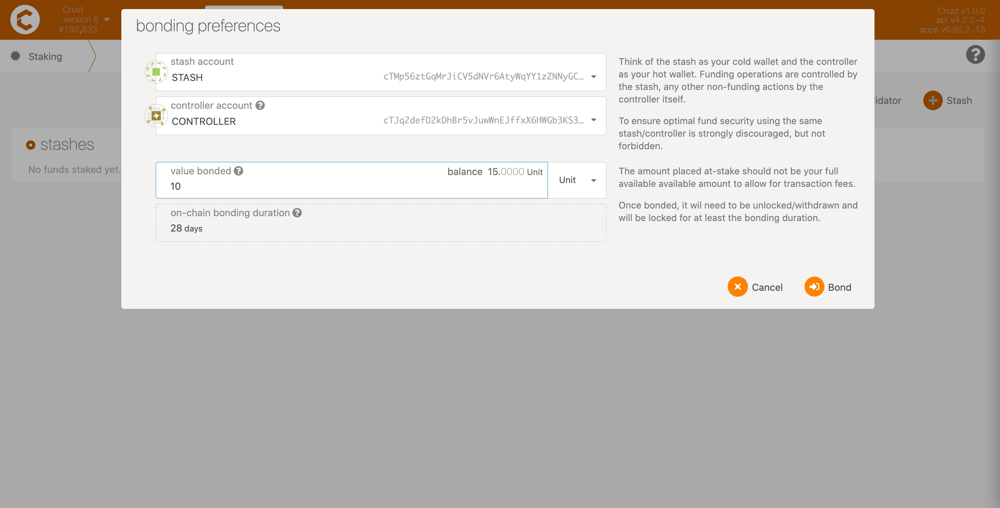
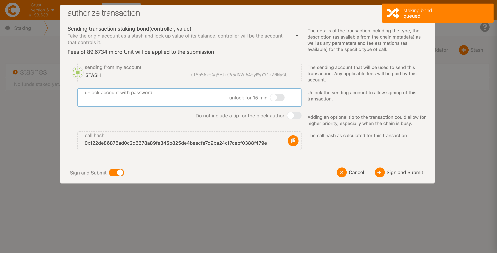

Crust account, featuring a standard dual account (Controller/Stash) model, needs to go through a set of account bonding procedures. In the dual-account model, the Controller account is used as a hot wallet, and only a small amount of CRU is required as a transaction fee to support most operations, reducing possible risks. This section will illustrate how to create accounts and bond account relationships through actions in Crust APPs.

## Create a stash account

## 1 Create Controller & Stash accounts

### 1.1 Controller

We will create a new account for asset operations, click here [link](crust-account.md) for the instructions for creating an account:

We named the first account CONTROLLER to remind ourselves that this account will be used as a Controller to manipulate assets. There needs to be a certain number of CRUs in the account to pay transaction fees for various transactions.

### 1.2 Stash

Repeat the [new account](crust-account.md) steps to create another account:

We will use the second newly created account as the Stash account. Stash account is the user's asset account, used to manage the user's assets. There needs to be a certain number of CRUs in the account for subsequent operations such as various transactions and asset mortgages.

## 2 Bond Controller to Stash
Click "Staking" from the "Network" column in the navigation bar, and select "Account actions".

Click "Stash" in the upper right corner, select Stash and Controller account in the pop-up window, enter the number of CRUs to be staked ("number" here is the number of CRUs allowed to be controlled by the Controller account), and then click "Stake".

Since staking needs to be performed on the chain, it is required to unlock the Stash account and pay a certain amount of fees.

When staking is successfully implemented, you can find that a staking relationship has now been added to the "Account actions" window.

To this far, your account configuration has been well completed.
