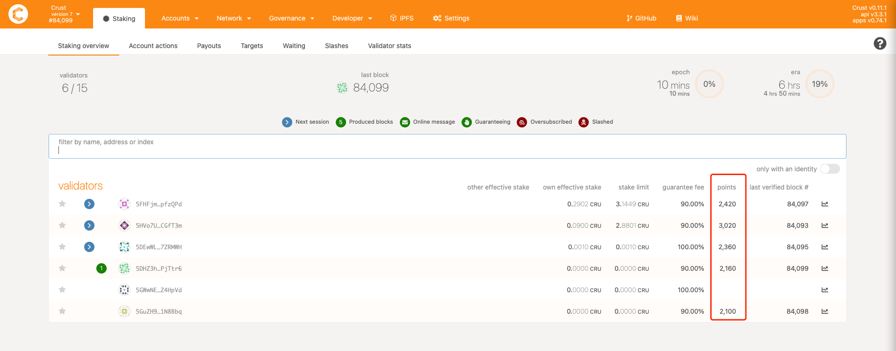
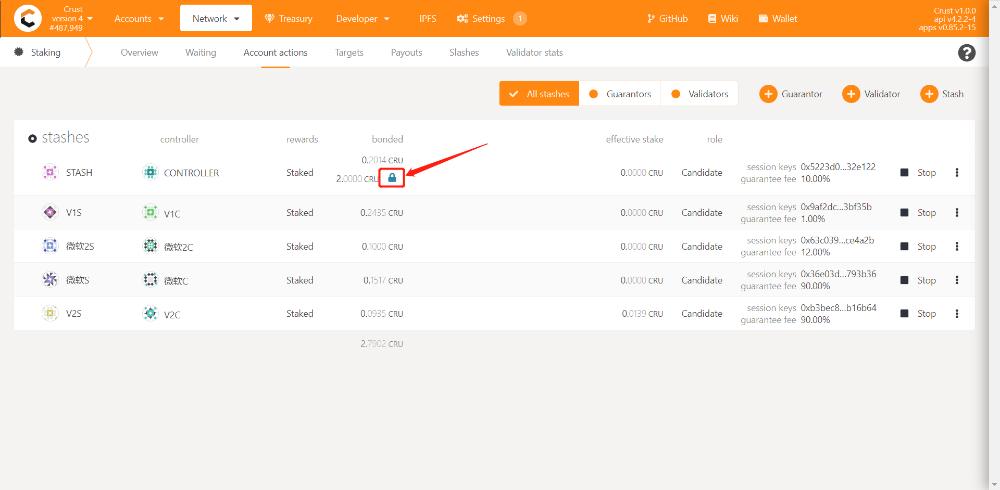

## Overview

Crust chain is composed of many Validator and Candidate nodes. The validators are elected from the candidates according to the effective staking amount in each ERA. The validator is the node that validates transactions and generates blocks in Crust Network, also maintaining the security of Crust Network.

Under the GPoS (Guaranteed Proof of Stake) consensus of Crust Network, validator nodes obtain rewards via staking and block generation.

## Validators’ Rewards and Slash

### 1.Rewards

The rewards of validators are composed of two parts: **authoring rewards and staking rewards**. Normally, validators will receive both the authoring and staking rewards, while candidates receive only staking rewards.

**In Crust mainnet, each Era (6 hours) generates authoring and staking rewards**, more details about the reward decreasing refer to [economic whitepaper](https://crust-data.oss-cn-shanghai.aliyuncs.com/crust-home/whitepapers/ecowhitepaper_en.pdf).

#### 1.1 Authoring rewards

Authoring rewards are the incomes obtained by validators participating in block generation and transaction packaging in Crust Network. The incomes are related to staking points. The Babe algorithm randomly selects a validator for each block to produce the block. Normally, each validator's block production score is roughly average. If the validator does not have a block production score, please check the chain operation of the Owner machine. **No block production score means no block production reward**.



The authoring rewards for each validator in each Era are calculated as:

```shell
authoring_rewards = total_authoring_rewards * point_ratio (individual_points / total_points)
```

A new round of validator elections will be conducted in each era, and the next validator of the era will be selected from all candidates and validators. The rule for the election is:

```shell
Electing from high to low according to effective stake 
```

#### 1.2 Staking rewards

Staking rewards refer to the validators or candidates who hold storage resources obtaining incomes through staking CRUs. The staking income is related to the following factors:

- Stake Limit: The Stake Limit determines the upper limit of the effective stake of CRUs by the validator, which is directly related to the amount of storage provided by the validator. In Crust mainnet, a 1TB SRD([check the meaning of SRD from glossary](glossary.md)) file corresponds to an upper limit of 1CRU, and a meaningful file corresponds to 1-10 times the upper limit of SRD, with specific "times" related to the number of duplicates of meaningful files. For details, please refer to [DSM Guidance](DSM.md);
- Effective Stake: The Effective Stake is **the amount of staking that actually generates incomes**, which is related to the stake limit of the validator that is guaranteed. An example will be provided later.
- Guarantee fee: Guarantee fee is the ratio of the share to guarantors. The larger the value, the higher the guarantor’s revenue share. However, **A higher guarantee fee does not mean higher guarantee income**. The guarantee income of any guarantor needs to consider the effective stake and his own staking amount.

> When a Validator or Candidate adjusts its own guarantee fee, the guarantee fee of the first Era after the adjustment will be set to 100% compulsively, which means that all the income of the node except for its own effective stake will be distributed to the guarantor. After an Era, the guarantee fee is restored to the value set by the Validator/Candidate.

> For example, if the validator obtains 900 CRU staking rewards and 100 CRU block generation reward in one era, and if his self-staking accounts for 90% of his total staking(The remaining 10% is contributed by guarantors). If the guarantee fee is 95%, then the guarantors finally obtains (900 + 100) * 10% * 95% = 95 CRUs income, and the remaining 905 CRUs belongs to the validator.

The income obtained by the validator and candidate is calculated as following steps:

```shell
validator_total_staking_amount = self_staking_amount + guarantee_amount
```

```shell
validator_effective_staking_amount = MIN (stake_limit, validator_total_staking_amount) * (self_staking_amount / validator_total_staking_amount)
```

```shell
guarantor_effective_staking_amount = MIN (staking_limit, validator_total_staking_amount) * (guarantee_amount / validator_total_staking_amount)
```

```shell
validator_rewards = total_staking_rewards * validator_effective_staking_amount / total_effective_staking_amount + total_staking_rewards * guarantor_effective_staking_amount / total_effective_staking_amount * (1 - guarantee_fee)
```

The following is an example:

If node A staked 1000 CRUs itself, and was guaranteed with 200 CRUs. The staking upper limit is 1000 CRUs, with the guarantee fee set at 95%, and the staking income generated per round is 600 CRUs. Supposing the effective staking amount of the network is 2000 CRUs, we can work out the income of each Era:

1. Validator's effective staking amount = MIN（1000， 1200）*（1000 / 1200） = 1000 * （1000 / 1200） = 833.3 CRU
2. Guarantor's effective staking amount = MIN（1000，1200）* （200 / 1200）= 1000 * （200 / 1200） = 166.66 CRU
3. Validator's rewards = 600 * （833.3 / 2000） + 600 * （166.66 / 2000） * 5% = 252.49

#### 1.3 Withdraw rewards

The validator’s **authoring rewards and staking rewards cannot be directly received and transferred**, but will be changed to the [Binding](new-bond.md) state to increase the staking amount of the validator itself. To make the rewarding tokens transferable, you need to do the following steps:

1. you need to do the [unbond](https://wiki.crust.network/docs/en/validatorGuidance#32-decrease-the-amount-of-self-staked-token) for the amount that you want to withdraw.
2. After 28 days, you can withdraw your reward by click the "withdraw" icon as the following picture.



### 2. Slash

Only validators (block generators) and the nodes that actually package blocks and transactions will get slashing. It should be noted that:

1. Conditions for slash

- At the end of each Session (1 hour), an examination will be performed to detect whether validators are offline. Once validators are found to be offline, the slash mechanism will be triggered to calculate the slashing amount;
- Each time a block is generated, the packager (block author) of the block will be checked on double authoring. If it is detected that the packager attempted to generate two different blocks out of the same block height, a slash will be imposed on him.

2. Consequence of slash

The staked CRUs will be deducted according to the slash ratio, and the validator himself will be revoked the entitlement. The validator in the state of slash will lose the guaranteed part before him being slashed.

3. Slash ratio

The slashing amount is the maximum slash ratio that occurs in a SlashingSpan multiplied by the validator’s effective stakes:

```shell
slash_ratio = min((3 * (k - (n / 10 + 1))) / n, 1) * 0.07
```

where **k is the number of offline validators in one era and n is the overall number of validators (for block authoring).** Less than 10% offline triggers 0% slash which however can climb linearly up to the maximum of 7%. When one-third of the validators are offline, the slash ratio is approximately 5%.

4. Deduction time point for slash

The slash will not take place instantly, rather, a delayed deduction comes after 108 Eras (27 days). A slash that does not actually occur can be canceled (applicable through the Democracy).

## To become a validator

To become a validator of Crust Network requires you to have a certain amount of storage resources, a high-quality network, as well as configured nodes ready. For details, please refer to the description of validators (nodes) in [Validator Guidance](validatorGuidance.md).
